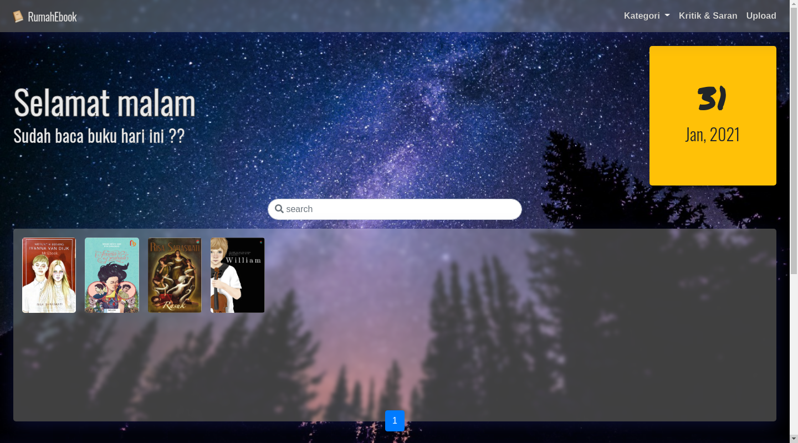
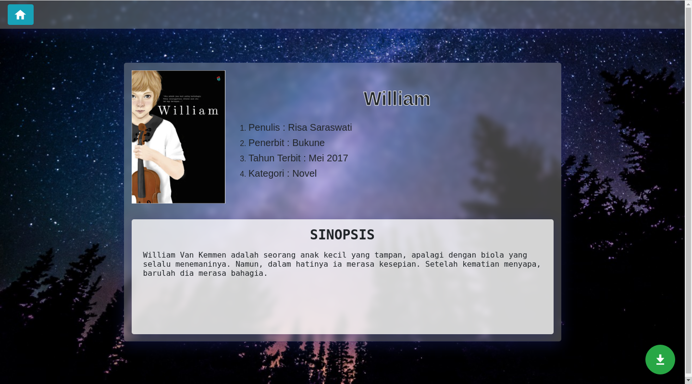
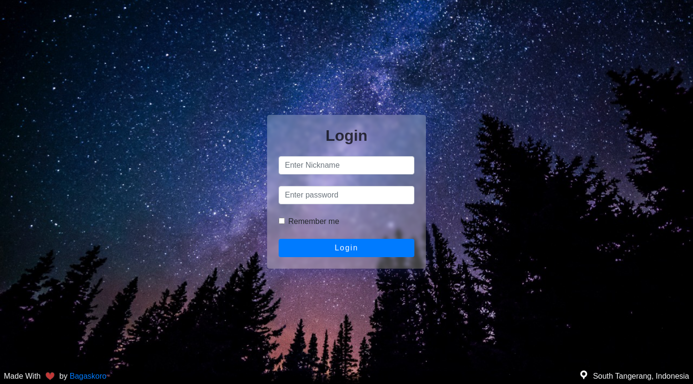
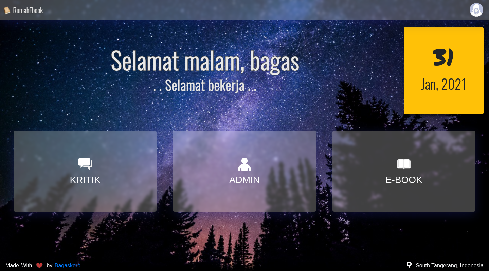
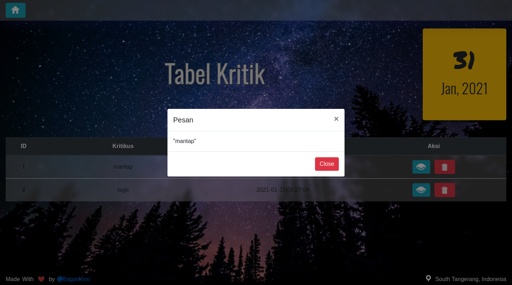
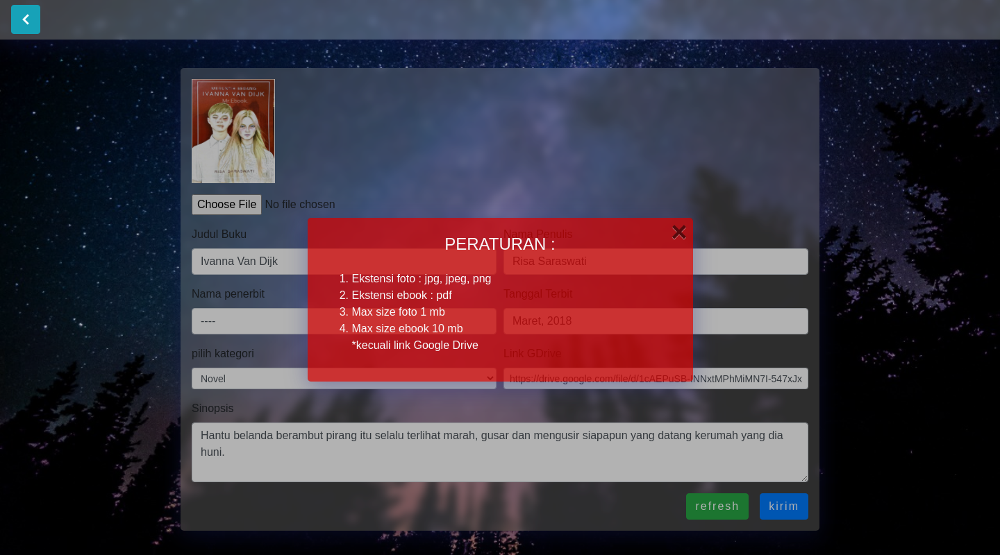

# RUMAHEBOOK
this is a simple website for downloading ebooks. I made this web for my friend who loves to read pirated books. This website is made with bootstrap 4 and PHP native(procedural).

# Tools
- [x] VS Code
- [x] PhpMyadmin

# Features
* Login for Admin
* Admin Page
* Live Search
* automatically background changer

# Screenshoot
Live Demo Can access at <a href="http://rumahebook.epizy.com/">http://rumahebook.cc/</a>   
  
  
  
  
  
  